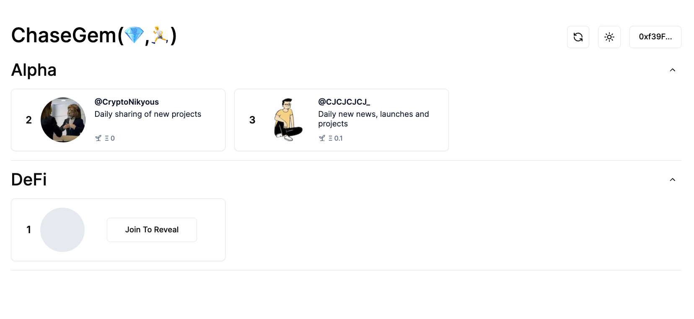

# ChaseGem

ChaseGem is a decentralized platform designed to help users discover and support trustable information sources called Gems. It aims to uncover niche, high-quality information sources across various fields that often have limited followers despite their exceptional content.

[web repository](https://github.com/script-money/chase-gem-web)

[contract repository](https://github.com/script-money/chase-gem-contract)

## Features

- Administrators can add Tags and Gems to the platform
- Users can join by minting a corresponding 1155 NFT
- Support Gems by sending rewards in ETH
- All data stored on-chain, without using an indexer

## Technologies

- Foundry, Anvil, and Rivet Wallet for local contract development
- Next.js for website development
- wagmi@2 (alpha version) for the front-end framework
- MaskNetwork's "web3.bio" for obtaining supporter information

## Future Plans

- Deploy on zkevm
- Integrate cross-chain
- Add more Gems
- mechanism for users to recommend Gems
